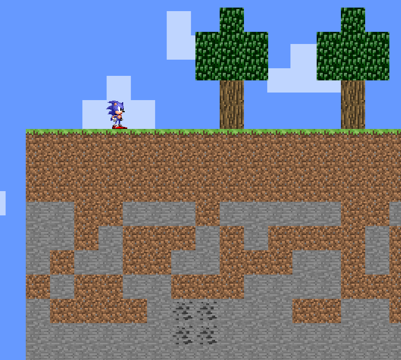

# minecraft2DJS
A WIP Minecraft 2D in native JS using canvas

**Sonicraft - A web 2d minecraft featuring sonic**

*preview of the game*

**TODO : gameideas**
- make sonic jump and break sprites when he jumps and roll up
- destroy platforms randomly, and goal could be to stay alive the longest possible
- create timer and goal is that sonic goes down the fastest to find diamond/ring and then he has to bring it back to the chest
- horizontal scrolling and sonic must jumping from platforms to platforms to stay alive

**TODO:**
- Camera/Scrolling
- Collision
- Breaking block
- Chunck
- Improve map generation (add blocks, caves, structures)
- Add mobs
- Save/Load current map
- Add inventory
- Add water and handle water physics